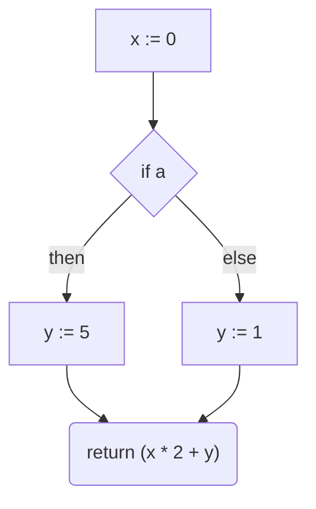
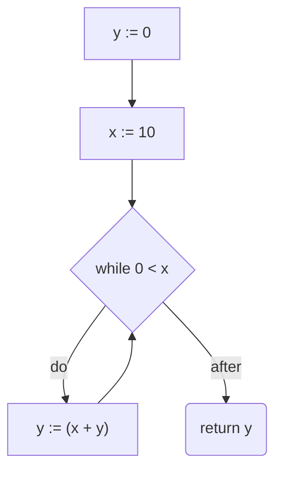
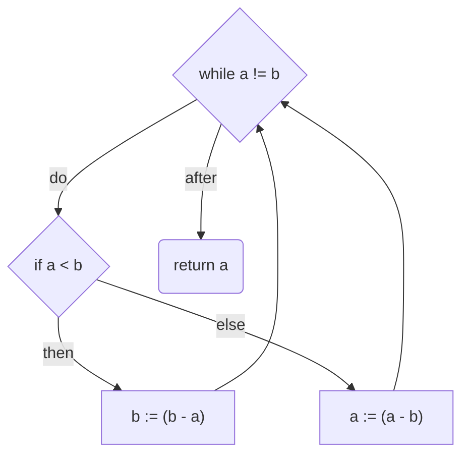

## Project description
Project is an implementation of a problem crated by Komi Golov, Ilya Chernikov for jetbrains internship (https://internship.jetbrains.com/projects/1637).
It transforms abstract syntax tree of predefined statemets and expressions into control flow graph.

My implementation is inspired by continuations, which are a way to recursively construct control flow graph from the end of the program. 

## AST syntax
- Statements
  - blocks
  - assignments
  - if (else)
  - while
  - return
- Expressions
  - constants
  - variables
  - (in)equality
  - addition
  - subtraction
  - multiplication

## Sample results
- Sample program with AST:
```
Stmt.Block(
    Stmt.Assign(Expr.Var("x"), Expr.Const(0)),
    Stmt.If(
        Expr.Var("a"),
        Stmt.Assign(Expr.Var("y"), Expr.Const(5)),
        Stmt.Assign(Expr.Var("y"), Expr.Const(1))
    ),
    Stmt.Return(
        Expr.Plus(
            Expr.Mul(Expr.Var("x"), Expr.Const(2)),
            Expr.Var("y")
        )
    )
)
```
can be turned into a flowchart in Mermaid:


- Program computing _gcd_ of variables `a` and `b`
```
Stmt.Block(
    Stmt.While(Expr.NEq(Expr.Var("a"), Expr.Var("b")),
        Stmt.If(Expr.Lt(Expr.Var("a"), Expr.Var("b")),
            Stmt.Assign(Expr.Var("b"),
                (Expr.Minus(Expr.Var("b"), Expr.Var("a")))),
            Stmt.Assign(Expr.Var("a"),
                Expr.Minus(Expr.Var("a"), Expr.Var("b"))),),
    ),
    Stmt.Return(Expr.Var("a"))
)
```
results in following flowchart:


- A program that uses `while` to compute sum of numbers from 10 to 1 written below
```
Stmt.Block(
    Stmt.Assign(Expr.Var("y"), Expr.Const(0)),
    Stmt.Assign(Expr.Var("x"), Expr.Const(10)),
    Stmt.While(Expr.Lt(Expr.Const(0), Expr.Var("x")),
        Stmt.Assign(
            Expr.Var("y"),
            Expr.Plus(
                Expr.Var("x"),
                Expr.Var("y")
            )
        )
    ),
    Stmt.Return(Expr.Var("y"))
)
```
as a result gives the following graph:


## Files
- `Expr.kt` and `Stmt.kt` contain definitions of respective interfaces.
- `Programs.kt` defines a list of sample programs.
- `Node.kt` defines `Node` interface and logic of creations of CF diagrams as well as prettyPrinter for Mermaid flowcharts.
- `Main.kt` is a sample program that prints to console CF diagrams for sample programs.